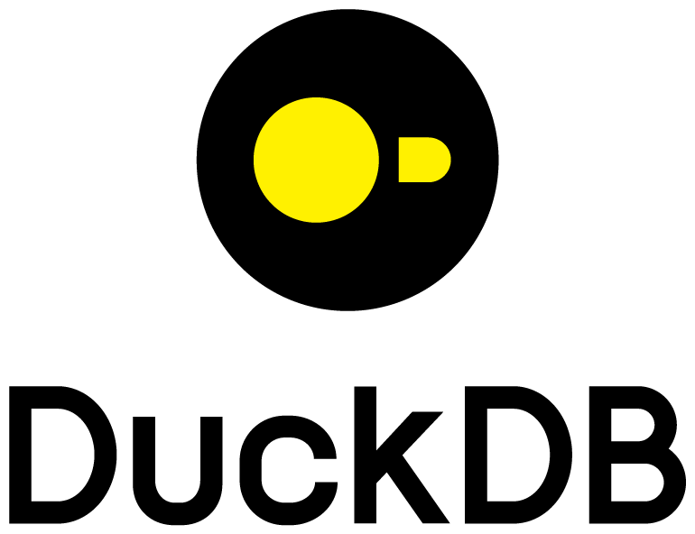

<h1 align="center">Ola 👋, Eu sou Luciano Borba</h1>
<h3 align="center">Sou Engenheiro de Dados</h3>

- 🔭 Atualmente estou trabalhando na Secretaria de Saúde do Estado da Paraíba **Engenheiro de Dados**
- 🌱 Atualmente minhas principais habilidades são relacionadas com: **Business Intelligence, Analytics Engineer, Data Analytics, Apache Airflow, Docker, SQL e Python**
- 📚 Atualmente estou estudando e praticando bastante sobre  **Testes, CI/CD, PySpark, Databricks**
- 👯 Atualmente colaboro com atividade de Integraçao de Sistemas **na Gerencia de Tecnologia da Informação**
- 👨‍💻 Compartilho minha atividades em [www.linkedin.com/in/luhborba](www.linkedin.com/in/luhborba)
- 💬 Pergunte-me sobre **Python, Django, Pentaho, ETL, SQL, Docker e Airflow**
- 📫 Me ache através do email: **luhborbafilho@gmail.com**
- 🌐	Acesse minha página pessoal: [https://luhborba.github.io/portifolio/](https://luhborba.github.io/portifolio/)

<h3 align="left">Projetos Relevantes na Carreira:</h3>

  -  Implementação de Sistema de Gestão de Processos Online, gerando economia aproximada de R$ 5 Milhões atualmente[Até 2023] na Prefeitura Municipal de João Pessoa ( Plataforma 1Doc ) [2022] 
  -  Criação do Primeiro Data Warehouse da Secretaria Municipal de Saúde de João Pessoa, utilizando Python + PostgreSQL [2022] 
  -  Implantação de Sistema para Auditoria Multidisciplinar na Rede Hospitalar e Pré-Hospitalar do Secretaria Municipal de Saúde de João Pessoa [2022-2023]
  -  Construção de Data Mart para acompanhamento dos Indicadores do Sistema de Auditoria Multidisciplinar, processo de ETL com Pentaho, utilizando SGBD Oracle SQL + Power BI [2022-2023]
  -  Desenvolvimento de Sistema para Acompanhamentos Oncologicos ( Python + Django ) [2023]
  -  Desenvolvimento de Sistema para Internação Hospitalar ( Python + Django ) [2023]
  -  Product Manager de Sistmea de Processo Seletivo para Saúde (Java + Spring) [2024 - Até o Momento]
  -  Parte da Equipe de Planejamento da Implantação do Prontuário Eletrônico do Cidadão da Prefeitura Municipal de João Pessoa ( Vivver Sistemas ), implantação realizada com sucesso em 3 Hospitais Municipais, 4 UPAS, 203 Equipes de Atenção Primária, 5 Policlinicas, Todas as Farmácias e Laboratórios Municipais [2022 - 2024]

## Hard Skills:
- Bancos de Dados Relacionais: SQL Server (T-SQL), Oracle (PL-SQL), MySQL, PostgreSQL, DuckDB
- Modelagem: Relacional, Dimensional
- Ferramentas de ETL: Pentaho, Integration Services
- Ferramentas de Orquestração: Apache Airflow
- Ferramentas de Dataviz: Apache Superset, Streamlit, Power BI, Python Plotly, Python Matplotlib, Python Seaborn
- Ferramentas de apoio: Excel, Git, Python para dados
- Ferramenta de Container: Docker

## Soft Skills:
- Habilidades de Comunicação
- Focado em Resolução de Problemas
- Colaboração
- Pensamento Crítico
- Constante Aprendizado

<h3 align="left">Conecte-se comigo:</h3>

<h3 align="left">Trabalho com as Seguintes Tecnologias: </h3>

 <!-- Python--><!-- SQL-->  <!--DuckDB--><!--Postgres--> <!--Linux--><!--Docker--><!-- MySQL-->         <!-- Oracle--> <!--Pands-->  <!--SQLite-->  <!--SQLAlchemy--><!--Airflow--><!--Pytest--><!--Streamlit--><!--Django--><!--Superset --><!--PowerBI-->

## 📊 Métricas do canal

  

    
  

  

    
  

## 📺 Vídeos Recentes

<!-- YOUTUBE:START --><table><tr><td></td>
<td><a href="https://www.youtube.com/watch?v=Eg0ioiNfZvM">Motivacional da Segunda - Quem você Sonha Ser</a> Jul 1, 2024</td></tr></table>
<table><tr><td></td>
<td><a href="https://www.youtube.com/watch?v=X0fSJypcK9A">Treinamentos para Área de Dados - Finalmente lancei meu Site - LR Data</a> Jun 24, 2024</td></tr></table>
<table><tr><td></td>
<td><a href="https://www.youtube.com/watch?v=XXE-QPoY4es">Utilizando Data Lake com MinIO e DuckDB  com Docker</a> Jun 20, 2024</td></tr></table>
<table><tr><td></td>
<td><a href="https://www.youtube.com/watch?v=hwIsXJxDj60">Reagindo a Noticia do MotherDuck Start e Futuras Integrações &lpar;DuckDB&rpar;</a> Jun 14, 2024</td></tr></table>
<table><tr><td></td>
<td><a href="https://www.youtube.com/watch?v=FfIUfFn5Abw">Como instalar MySQL e PHPMyAdmin com Docker</a> Jun 11, 2024</td></tr></table>
<!-- YOUTUBE:END -->

  
## Minhas Estatísticas do GitHub

## Linguagens Mais Usadas

## Resumo das Contribuições

## Visualizações ao Meu Pefil

